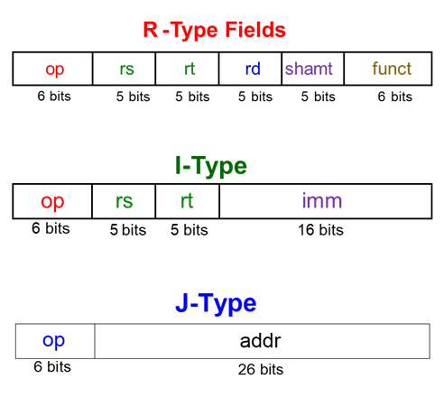

# Computer Architecture
## MIPS 2 - MIPS Assembler - Individual Assignment

### MIPS 2 Overview
* Fill in the answers to the questions in this document and submit it back to your whitgit folder
* Learn how Big/Little Endian works.
* Understand different types of MIPS instruction formats.
* Learn how to assemble/disassemble MIPS programs by hand.


### Grade Break Down
| Part                             |   | Points  |
|----------------------------------|---|---------|
| MIPS_2-1 - Assembling MIPS       |   | 20 pts  |    
| MIPS_2-2 - Little/Big Endian     |   | 10 pts  |   
| MIPS_2-3 - Dissassembling MIPS   |   | 20 pts  |   
| Total                            |   | 50 pts  |

NOTE: MIPS_2-4 the group project will be graded separately and will be worth 50 points as well. 


## Important Resources for Converting MIPS Assembler to Machine Code 
It is important to understand how to translate MIPS assembly language into machine code format. The purpose of learing how to do this is that it will help you learn how to design your own machine language instruction format. There are three major resources:

1. Appendix B of your Textbook. The appendix has examples of different MISP instructions that are available. You will want to become very familiar with this appendix!
2. The pdf file:  "MIPS Assembly Language Programming using QTSPIM" this pdf file is included in this project.
3. The lecture notes / textbook.  NOTE: There are many resources online that will translate MIPS to machine langauge for you. Be careful of these when translating jump/branch instructions. This is because when we implement MIPS on the board these will work slightly differently.

The following image shows the different machine code formats for MIPS.




# Exercise 2-1: Translating MIPS to Machine Code

### The Assembly Process
```
Look at the assembly language instruction keyword.

Identify the instruction (e.g. addi, sll, sw etc...)

Look up the associated code for the instruction in the appendix, is it J, R or I type?

Find the associated format. 

Fill out each field of the format based on the arguments to the instruction.
```
Given the following MIPS assembler program, translate each of the given instructions to MIPS machine code in the areas provided. The first one is done for you as an example. Enter your values directly in the tables below.

```mips
 addi $s0, $0, 22    	# $s0 = 0 + 22 = 22
 addi $s1, $s0, 20    	# $s1 = $s0 + 20 = 42
 sll  $s1, $s1, 2       # $s1 = $s1 << 2
 sw   $s1, 0x10($t2)    # store contents of $s1 to (0x10+$t2)
```

### The first instruction has been assembled for you as follows:

```mips
addi $s0, $0, 22    	# $s0 = 0 + 22 = 22
```

|               | OP    | RS     | RT    | IMM                 |
|---------------|-------|--------|-------|---------------------|
| Field Values  |(8)    | 0      | 16    | 22                  |
| Machine Code  |001000 | 00000  | 10000 | 0000 0000 0001 0110 |
| Size of Field |6 bits	| 5 bits | 5 bits| 16 bits             |
<br>

### 2-1.1 Assemble the following instruction, put your answers in the table below:

```mips
addi $s1, $s0, 20    	# $s1 = $s0 + 20 = 42
```

|               | OP     | RS     | RT    | IMM                 |
|---------------|--------|--------|-------|---------------------|
| Field Values  | (8)    | 16     | 17    | 20                  |
| Machine Code  | 001000 | 10000  | 10001 | 0000 0000 0001 0100 |
| Size of Field | 6 bits | 5 bits | 5 bits| 16 bits             |
<br>

### 2-1.2 Assemble the following instruction, put your answers in the table below:

```mips
sll  $s1, $s1, 2       # $s1 = $s1 << 2
```

|               | OP     | RS     | RT    | RD     | SHAMT   |  FUNCT  |
|---------------|--------|--------|-------|--------|---------|---------|
| Field Values  | (0)    | 0      | 17    | 17     | 2       | 0       |
| Machine Code  | 000000 | 00000  | 10001 | 10001  | 00010   | 000000  |
| Size of Field |6 bits	 | 5 bits | 5 bits| 5 bits | 5 bits  | 6 bits  |
<br>

### 2-1.3 Assemble the following instruction, put your answers in the table below:

```mips
sw   $s1, 0x10($t2)    # store contents of $s1 to (0x10+$t2)
```

|               | OP     | RS     | RT    | IMM                 |
|---------------|--------|--------|-------|---------------------|
| Field Values  | (43)   | 10     | 17    | 16                  |
| Machine Code  | 101011 | 01010  | 10001 | 0000 0000 0001 0000 |
| Size of Field | 6 bits | 5 bits | 5 bits| 16 bits             |


# Exercise 2-2: Little/Big Endian  
<br>

### 2-2-1 Little endian machine: 
* Store the integer 0xA1B2C3D4 in the following memory starting at memory location 0x1000102C. 
* IMPORTANT: Memory locations increase from bottom to top and from left to right... 

| BYTE ADDRESS	| Byte +0	| Byte +1	| Byte +2	| Byte +3 |
|---------------|-----------|-----------|-----------|---------|
| 0x10001034    |           |           |           |         |				
| 0x10001030    |           |           |           |         |				
| 0x1000102C    |   D4      |   C3      |   B2      |   A1    |				
<br>

### 2-2-2 Little endian machine: 
* Store the null terminated string “Endian” in the following memory starting at memory location 0x1000102C. 
* Memory locations increase from bottom to top and from left to right... 

| BYTE ADDRESS	| Byte +0	| Byte +1	| Byte +2	| Byte +3 |
|---------------|-----------|-----------|-----------|---------|
| 0x10001034    |           |           |           |         |				
| 0x10001030    |           |     \0    |    n      |    a    |				
| 0x1000102C    |     i     |     d     |    n      |    E    |				
<br>

### 2-2-3 Big endian machine: 
* Store the integer 0xA1B2C3D4 in the following memory starting at memory location 0x1000102C. 
* Memory locations increase from bottom to top and from left to right... 

| BYTE ADDRESS	| Byte +0	| Byte +1	| Byte +2	| Byte +3 |
|---------------|-----------|-----------|-----------|---------|
| 0x10001034    |           |           |           |         |				
| 0x10001030    |           |           |           |         |				
| 0x1000102C    |   A1      |   B2      |   C3      |   D4    |				
<br>

### 2-2-4 Big endian machine: 
* Store the null terminated string “Endian” in the following memory starting at memory location 0x1000102C. 
* Memory locations increase from bottom to top and from left to right... 


| BYTE ADDRESS	| Byte +0	| Byte +1	| Byte +2	| Byte +3 |
|---------------|-----------|-----------|-----------|---------|
| 0x10001034    |           |           |           |         |				
| 0x10001030    |     a     |     n     |     \0    |         |				
| 0x1000102C    |     E     |     n     |     d     |    i    |

# Exercise 2-3: Dissassembling MIPS 

Dissasembly is the process of taking a machine code program that is listed using 32 bit hex value, and determining the corresponding MIPS assembly language instruction for the machine code program.

#### Dissasembly Process
```
Translate each HEX instruction to a 32 bit binary value.
Identify the OPCODE field of that instruction.
Look at the binary value of the OPCODE

if OPCODE is all zeros
    You have an R-type instruction
    For the R-type instruction look at the FUNCT field to determine the instruction
else
    You have a J or I type instruction

Lookup the OPCODE (or FUNCT) in the Appendix of your book to determine instruction.

Repeat the process for the other instructions.
```

#### Graphic of the Dissasembly Process


Consider the following program. Convert it from MIPS machine code to assembler using Appendix B of your textbook. 

```
 ADDRESS   MACHINE CODE
[0040002c] 20100000  
[00400030] 2011000a
[00400034] 02118020  
[00400038] 2231ffff  
[0040003c] 1e20fffe  
```

You should be aware that this code was assembled using QTSPIM, and thus, 
* The immediate value of the last instruction is sign extended and shifted left two places. 
* QTSPIM adds this value TO THE CURRENT PC (0040003c) and NOT to PC+4 (00400040) as our book describes. 
* Thus, the target address of the last instruction will (in QTSPIM) be 00400034.  
* This is how you should interpret this algorithm to work for this exercise. 
* This unfortunately does not agree with the book which claims the offset should be added to (PC+4) and does not match with how the book's MIPS processor works. 

### 2-3-1 Write the MIPS Assembly language for the above program below in the space provided:

```mips
# Put your mips assembly language code immediately after this line

    addi $s0, $0, 0     
    addi $s1, $0, 10
    add  $s0, $s0, $s1
do: 
    addi $s1, $s1, -1
    bgtz $s1, do

```

### 2-3-1 Write code for a C++ program snippet (you don't need an entire C++ program, just the corresponding statements) that does exactly the same thing below in the space provided

```cpp

int i = 0;              // $s0 = i
int j = 10;             // $s1 = j
i += j;                 // $s0 = $s0 + $s1
do { 
    j--;                // $s1 = $s1 - 1
    } while ( j > 0);   // bgtz

/**
I kind of think the original intention of the machine code was created 
with the thought of having the following high-level code:

int i = 0;
int j = 10;
i = i + j;
while (j > i) {
    j--;
}

I am thinking this because there doesn't seem to be any reason for initiating the first 
variable (in this case I chose i) in the high level code.  However, I chose a do while 
loop because my perception is that the target address comes before the bgtz instruction 
within the flow of the program, so it will be executed one time before the PC arrives 
at the bgtz instruction

**/
```

