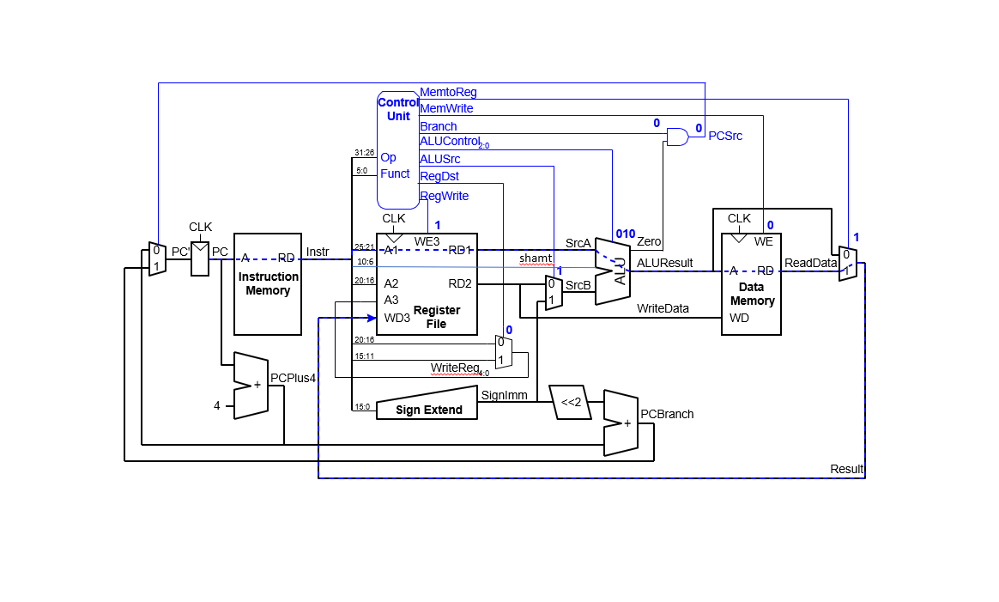
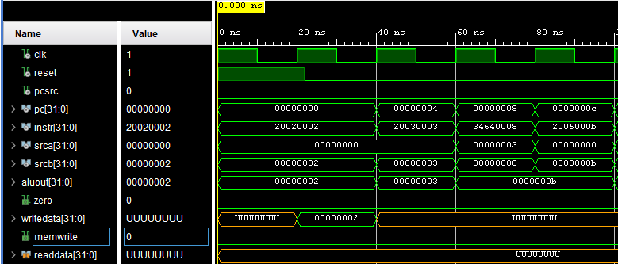
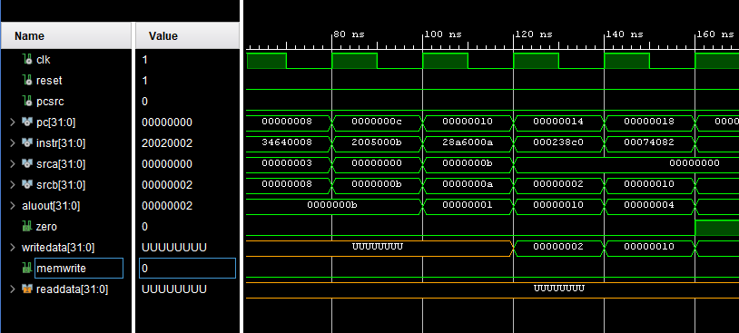

# Digital Design and Computer Architecture
## MIPS 4 Group Project - Extending the Single-Cycle Processor with More Instructions 

### MIPS 4 Overview
The learning goals for MIPS 4 as are follows:

* Extend your knowledge of the MIPS Single-Cycle Processor hardware by implementing new instructions.
* Learn how the VHDL hardware for a MIPS single cycle processor works
* Learn how to implement new instructions for the MIPS single cyle processor

### Grade Break Down
| Part                             |   | Points  |
|----------------------------------|---|---------|
| MIPS4 - Part 1 - slti and ori    |   | 10 pts  |
| MIPS4 - Part 2 - sll and srl     |   | 10 pts  |     
| MIPS4 - Part 3 - control unit and test program    |   | 10 pts  |  
| MIPS4 - Mini Presentation        |   | 20 pts  |    
| Total                            |   | 50 pts  |

# Introduction

In this lab you will (as a group) expand the MIPS single-cycle processor design even further than last time using VHDL. 
* You will implement four new MIPS instructions. 
* You will then write a new test program that confirms the four new MIPS instructions work. 
* In order to implement four new instructions you likely will need to make changes to the hardware for the processor.  
* By the end of this lab, you should have an even better understanding of the internal operation of the MIPS single-cycle processor and be ready to design your own processor from scratch (the final project).
* _Please read and follow the instructions in this lab carefully.  In the past, many students have lost points for silly errors like failing to include screen snips of the simulation signal traces requested in the lab._

As a group you must work on this part of the project together (on discord or using liveshare).
Make sure that each of you in your group have roughly equal time "driving" while the others looks for errors, discusses the process etc.

Please remember the rules of working together well!
* Share everything – work together at the same terminal and not separately.
* Play fair – don’t do all the work by yourself, OR hog the computer when typing.
* Don’t hit you partner – make sure to share tasks so one partner is not tempted to browse the web, text, etc. Give you partner the benefit of the doubt but also encourage them to contribute.
* Put things back where you found them – put away negative thoughts and don’t dwell on them. Focus on the positives.
* Clean up your own mess – pair programming will help you catch mistakes early and often.
* Don’t take things too seriously – have fun and be proactive.

# MIPS4 Design

Modify the following schematic (if neccessary) to support the four new instructions. This jpg was made from the ```schematic.pptx``` file located in this folder. If you need to modify it in order to support the instructions, you can edit this PowerPoint slide. Once you have modified the slide, you can export it as a jpg into this folder and save it over the existing ```schematic.jpg```. Your changes should then become apparent in this document.  I recommend drawing any new signal wires or components in a different color than in the original schematic.



## (10 pts) Part 1: Add the two I-type instructions: slti, ori 
Add the two instructions to the VHDL hardware for the MIPS single-cycle processor. First, read Appendix B, table B.1 then complete the follow two markdown tables below so that they contains a binary level description of the assembly language instruction given. This will help you understand the format of the instructions. Then add the instructions to the processor.

### I-type Instruction ```slti```

Complete the following table (use binary bits) for the given instuction. Put the hex code equivalent of the instruction in the space provided below.

| Assembly Code     |  op        | rs      | rt      | imm                 | 
|-------------------|------------|---------|---------|---------------------|
|  slti $7, $5, 15  | 001010     | 00101   | 00111   | 0000 0000 0000 1111 |

```
Put hex code equivalent here
0x28A7000F
```

### I-type Instruction ```ori```

Complete the following table (use binary bits) for the given instuction. Put the hex code equivalent of the instruction in the space provided below.

| Assembly Code     |  op        | rs     | rt       | imm                 | 
|-------------------|------------|--------|----------|---------------------|
|   ori $7, $5, 15  | 001101     | 00101  |  00111   | 0000 0000 0000 1111 |

```
Put hex code equivalent here
0x34A7000F
```


## (10 pts) Part 2: Add the two R-type instructions: sll, srl 
Add the following two R-type instructions to the VHDL hardware: sll, srl (see appendix B, table B.2). Complete the markdown descriptions of each of the instructions below by completing the instruction in binary and hex. This will help you understand the format of the instructions. Then add the instructions to the processor.

### R-type Instruction sll

Complete the following table (use binary bits) for the given instuction. Put the hex code equivalent of the instruction in the space provided below.

| Assembly Code     |  op  | rs  | rt  | rd  |shamt|funct | 
|-------------------|------|-----|-----|-----|-----|------|
| sll $7, $5, 4     |000000|00000|00101|00111|00100|000000| 

```
Put hex code equivalent here
0x00053900
0000 0000 0000 0101 0011 1001 0000 0000
```
Complete the following table (use binary bits) for the given instuction. Put the hex code equivalent of the instruction in the space provided below.

### R-type Instruction srl

| Assembly Code     |  op  | rs  | rt  | rd  |shamt|funct | 
|-------------------|------|-----|-----|-----|-----|------|
| srl $7, $5, 4     |000000|00000|00101|00111|00100|000010|

```
Put hex code equivalent here
0x00053902
0000 0000 0000 0101 0011 1001 0000 0010
```

## Part 3: Control Unit Modifications and Test Program

Modify the tables below for the ```main decoder``` and the ```ALU decoder```, as needed, in order to account *for all* the instructions in your processor. You may or may not need to add more control signals.

| **Instruction** | **Op[5:0]** | **RegWrite** | **RegDst** | **AluSrc** | **Branch** | **MemWrite** | **MemtoReg** | **ALUOp[2:0] **|** Jump** |
| --------------- | ----------- | ------------ | ---------- | ---------- | ---------- | ------------ | ------------ | -------------- | -------- |
| R-type          | 000000      | 1 | 1 | 0 | 0 | 0 | 0 | 010 | 0 |
| lw              | 100011      | 1 | 0 | 1 | 0 | 0 | 1 | 000 | 0 |
| sw              | 101011      | 0 | X | 1 | 0 | 1 | X | 000 | 0 |
| beq             | 000100      | 0 | X | 0 | 1 | 0 | X | 001 | 0 |
| addi            | 001000      | 1 | 0 | 1 | 0 | 0 | 0 | 000 | 0 |
| j               | 000010      | 0 | X | X | X | 0 | X | XXX | 1 |
| slti            | 001010      | 1 | X | 1 | 0 | 0 | 0 | 100 | 0 |  
| ori             | 001101      | 1 | 0 | 1 | 0 | 0 | 0 | 101 | 0 |
| sll             | 000000      | 1 | 1 | 0 | 0 | 0 | 0 | 010 | 0 |
| srl             | 000000      | 1 | 1 | 0 | 0 | 0 | 0 | 010 | 0 |

You may or may not need to add extra ALUOp signals:

| **ALUOp[2:0]**|** Meaning** |
| ------------- | ----------- |
| 000           | Add         |
| 001           | Subtract    |
| 100           | slti        |
| 101           | ori         |

## Assembly Language Test Program for your modified MIPS single-cycle processor

For this part your group will create an assembly language test program (```test_4.s```) for the modified MIPS processor that uses all four of the new instructions.
* You may if you wish add more instructions, but, you are not required to at this time. 
* You may also if you wish modify the I/O for the processor, but, you are not required to at this time.

Put the mips assemly language code for your program here (make sure it uses all three of the new instructions):
   
   ```asm

# MIPS 4

#       Assembly              Machine   Description
main:   addi $2, $0, 2      # 20020002  $2 = 2 
        addi $3, $0, 3      # 20030003  $3 = 3 
        ori  $4, $3, 8      # 34640008  $4 = 3  (0011) or 8 (1000) = 11 (1011)
        addi $5, $0, 11     # 2005000b  $5 = 11 
        slti $6, $5, 14     # 28a6000a  $6 = 0  ($5 = 11 < 10) 
        sll  $7, $2, 3      # 000238c0  $7 = 16 Shift binary value in $2 left 3 : (0000 0010 -> 0001 0000)      
        srl  $8, $7, 2      # 00074082  $8 = 4  Shift binary value in $7 right 2 : (0001 0000 -> 0000 0100) 

   ```


## Translate to Machine Code
Translate your assembly language program to machine code. Create a hex machine code file named ```memfile_4.dat``` that will contain the "assembled" program. You will need to modify the VHDL impure function code that load the machine code instructions. You will need to modify it to load ```memfile_4.dat```. 

Also, include the hexcode directly here:

  Hex Code for the test program

  ```
20020002
20030003
34640008
2005000b
28a6000a
000238c0
00074082

  ```

  NOTE: You may if you wish use PCSpim to generate part of the machine code for ```memfile_4.dat``` from the file ```test_4.s```. Remember that QTSpim will NOT give you the correct machine code for any of the jump or branching statements in your program! 
  
  The generated instruction machine code for jumps and branches may differ from what is needed for your machine. For example:
  * Our machine code starts the text segment at address ```0x00000000``` instead of ```0x00400000``` 
  * Our memory starts at address ```0x00000000``` in data memory rather than ```0x10000000```. 
  
  You will need to figure out how to generate the correct the machine code instructions so that the code works on our mips machine!

## Simulation of the Test Program
Generate a simulation waveform that shows that your group's test program is running correctly on the MIPS simulator. You must use the following signals in your simulation waveform trace:

  ```
  clk, reset, pcsrc, pc, branch, instr, srca, srcb, aluout, zero, writedata, memwrite, readdata 
  ```
  Include these signlas in that **exact** order! Make sure all your waveforms are readable and show values in hexadecimal. Take enough screen shots of the simulation trace (as you did before) and include them in this document directly here to demonstrate that your code is working. Make sure the waveforms are readable:

  ### Simulation Waveform Images
  

  

  


## Running the MIPS Test program on the FPGA

Make sure your ```test_4``` program can run successfully on the FPGA. Remember the clock on the FPGA has been slowed down in order to verify that the program works correctly. 

## Summary of Deliverables in this Project Folder

Please submit each of the following items, clearly labeled and in the following order:

1. This entire document with the entries filled out as requested in this document.
2. The modified **vhdl** and **dat** files for the exercises as described above.
3. Follow instructions **carefully** for the simulation waveforms and tables. 
   
Because of the high standards we have for our Whitworth students, we want you to do this correctly. For the waveforms, you will need to take multiple screen shots of the simulation trace and include them in this document as required.

# MIPS4 - Mini Presentation 

On the due date for this design, groups will take 5 minutes (max) and present their hardware design and test algorithm to the class. Your group will be graded on whether you present the following items. **Do not use more than 4 or 5 slides to summarize your project.**

* **Minute 1**: What hardware changes did you make to MIPS to accommodate the four instructions? Show a diagram of the changes. 
  
* **Minute 2**: Show the corresponding VHDL changes for the hardware changes that were made.

* **Minute 3**: A neat assembly language listing of your MIPS test program. You must include comments.

* **Minute 4**: An image (or video) of yuour program running on the FPGA.

* **Minute 5**: A discussion of the process and result. 
  - What went well? What not so well?
  - Did you get both simulation and FPGA working?
  - Did you do anything above and beyond the requirements (not required)?
